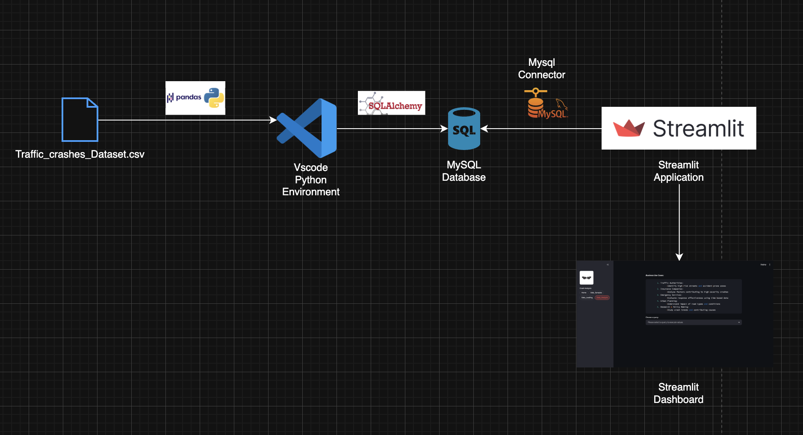

# Traffic Crash Analytics Dashboard

## Project Overview

Traffic Crash Analytics Dashboard is a SQL driven data analytics project designed to analyze large scale traffic crash records and extract meaningful insights related to road safety, injury patterns and crash causes. The project combines advanced SQL analysis with an interactive Streamlit dashboard to visualize query results.

## Problem Statement

Traffic crash data contains valuable information that can help improve road safety, optimize emergency response and support policy decisions. Extracting meaningful insights from large scale structured data requires strong SQL and analytical skills.

This project focuses on:

- Analyzing crash data using advanced SQL techniques.
- Generating actionable business insights from structured data.
- Building an interactive dashboard to present analytical findings.

## Project Worflow

The following workflow illustrates the complete data pipeline used in this project, from loading the dataset to visualizing analytical insights through a Streamlit dashboard.



### Workflow Explanation

1. **Dataset Loading**
   - Load the `Traffic_crashes_Dataset.csv` file into the Python environment using Pandas.

2. **Data Validation**
   - Verify the dataset by checking the schema, data types and row count

3. **Database Integration**
   - Establish a connection to the MySQL database using SQLAlchemy.
   - Import the dataset into MySQL using `df.to_sql()`.

4. **SQL Analysis**
   - Execute analytical SQL queries using:
     - Aggregations
     - Window Functions
     - Subqueries

5. **Streamlit Application**
   - Connect Streamlit to MySQL using the MySQL Connector.
   - Display results in tables along with business insights.

6. **Dashboard**
   - Users can see different analytical queries through Streamlit interface.

## Business Use Cases:
### Traffic Authorities
  - Identify high-risk streets and accident-prone zones
### Insurance Companies
  - Analyze factors contributing to high severity crashes
### Emergency Services
  - Evaluate response effectiveness using time based data
### Urban Planning
  - Understand impact of road types and conditions
### Research & Policy Making
  - Study crash trends and contributing causes

## Technology Stack

### Programming Language
- Python, SQL
### Database
- MySQL
### Data Analysis
- Pandas
### Dashboard Framework
- Streamlit
### Development Tools
- Visual Studio Code (VS Code)
### Version Control
- Git
- GitHub


## Project Structure
```text
Traffic_Crash_Analysis/
│
├── streamlti_apps.py
├── requirements.txt
├── README.md
├── .gitignore
├── Data/
│   └── Traffic_CrashesData.csv
│   └── car-logo.jpg
└── Data_Exploration.ipynb
└── Data_Loading.ipynb
```

## Key analyses performed

- Top dangerous weather and crash type combinations
- Streets with highest injury crashes
- Injury percentage by crash type
- Peak crash hour by month
- Night time crash causes
- Injury comparison between daylight and darkness
- Traffic control devices associated with injuries
- Highest crash frequency locations
- Streets with highest injury rate
- Most common crash type per year
- Day with highest average crashes per hour
- High risk time slot analysis
- Top contributing causes by crash type
- Year-over-Year crash growth analysis
- Hotspot zone identification using geographic clustering


## Result
Developed an dashboard where results are displayed using Streamlit tables.


## Learning Outcomes
- Advanced SQL query writing
- Window functions and analytical SQL
- Data exploration and insight generation
- Database integration with Python
- Streamlit application development


## How to Run the Project
### Clone Repository
- git clone <repository-url>
- cd Traffic_Crash_Analytics_Streamlit_Project
### Install Dependencies
- pip install -r requirements.txt
### Run Streamlit Application
- streamlit run streamlti_apps.py


